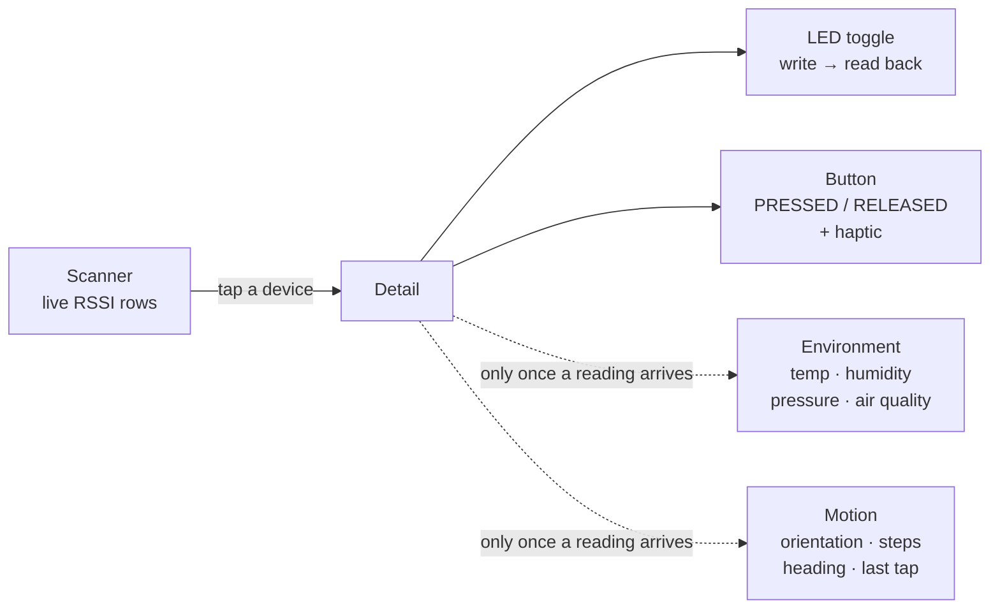
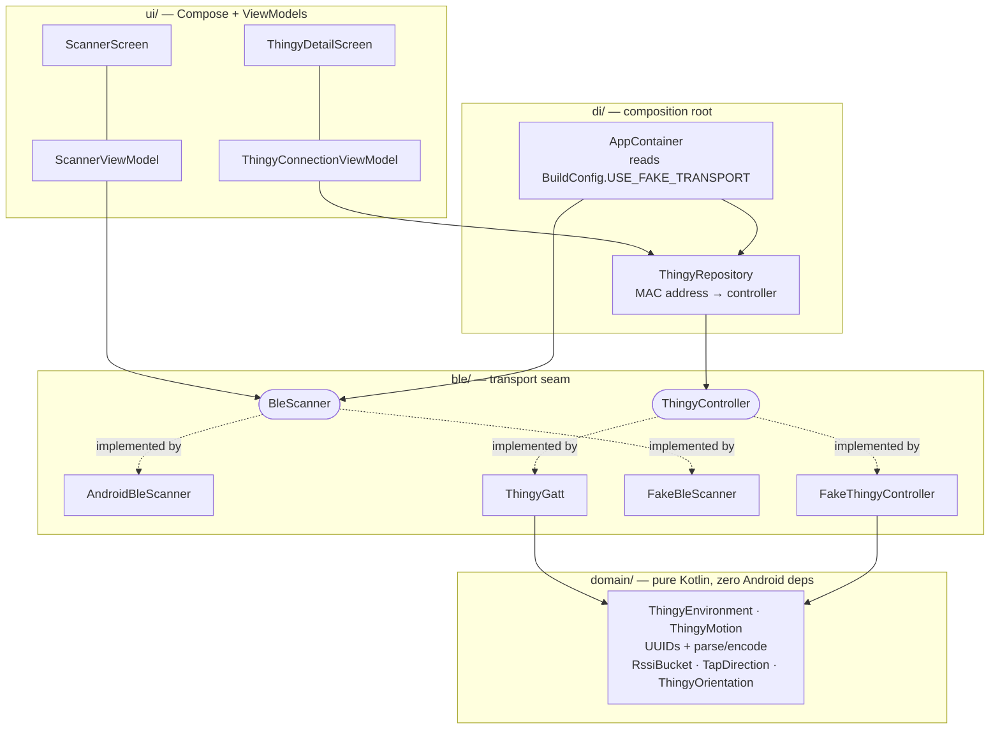
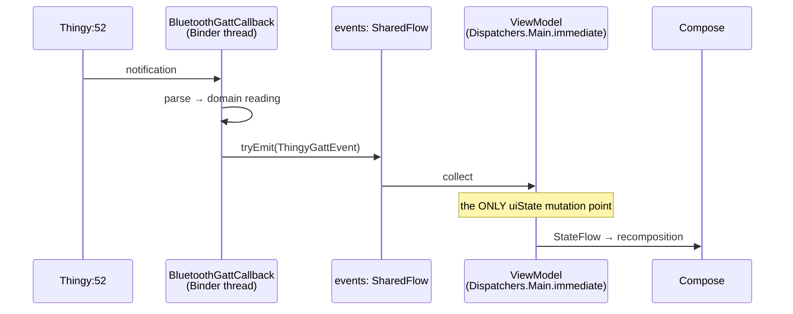
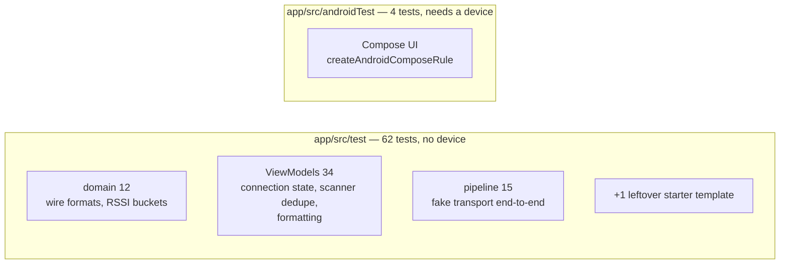

# nRFThingy52Android

A Kotlin + Jetpack Compose app for the [Nordic Thingy:52](https://www.nordicsemi.com/Products/Development-hardware/Nordic-Thingy-52)
Bluetooth LE development kit. Scan for nearby Thingys, connect, toggle the on-board LED, watch the
physical button, and stream the environment and motion sensors.

It is a **behavior-for-behavior parity port of a sibling iOS app** — same GATT profile, same wire
formats, same screens, same strings, same brand colors. Where the two platforms differ, the
divergence is deliberate and documented rather than incidental.

<!-- Screenshots: add once the launcher icon restyle lands (see "Status" below). -->

---

## Status

| Area | State |
|---|---|
| Domain, transport seam, both transports, all screens, localization | ✅ Complete |
| Automated tests | ✅ 62 JVM unit tests + 4 instrumented tests, green |
| Nordic-branded launcher icon | ✅ Complete |
| **Real-hardware verification** | ⛔ **Never run** — see below |

> **⚠️ The real BLE transport has never touched real hardware.** Everything in this app is proven
> against a fake transport. `ThingyGatt` — the Nordic-`ble-ktx`-backed connect / discover / notify /
> read pipeline — is **written but entirely unproven**, because verifying it needs a physical
> Thingy:52 *and* a physical Android device: the emulator has no BLE radio. Treat the `prod` flavor
> as unvalidated until that checklist is run.

---

## Build & run

The build needs **Java 17+**. If the system JDK isn't on your `PATH`, use Android Studio's bundled
runtime:

```bash
export JAVA_HOME="/Applications/Android Studio.app/Contents/jbr/Contents/Home"
```

### Product flavors — pick your transport

There is no plain `installDebug`. The app has two flavors on the `transport` dimension, so tasks are
named `{mock,prod}{Debug,Release}`:

| Flavor | `BuildConfig.USE_FAKE_TRANSPORT` | Use it for |
|---|---|---|
| `mock` | `true` | **Hardware-free development.** Links the fake transport; needs no BLE permissions, no adapter, no device. Streams live demo sensor readings. |
| `prod` | `false` | Real BLE against a real Thingy:52. |

```bash
./gradlew installMockDebug     # hardware-free — start here
./gradlew installProdDebug     # needs a real device + a real Thingy:52
```

### Everything else

```bash
./gradlew build                          # all 4 variants + lint + unit tests
./gradlew test                           # JVM unit tests, all variants
./gradlew testMockDebugUnitTest          # …just mock/debug (faster)
./gradlew connectedMockDebugAndroidTest  # Compose UI tests — needs a device/emulator
./gradlew lint
```

Run a single test class or method:

```bash
./gradlew test --tests "*.RssiBucketTest"
./gradlew test --tests "*.ThingyEnvironmentTest.parsesTemperature"
```

---

## What the app does



The two dashboards are **gated on data, not on connection**: each appears only when at least one of
its fields is non-null, matching the iOS app. Until then the detail screen shows just LED and Button.

---

## Architecture

Single-Activity Compose app. MVVM with `ViewModel` + `StateFlow`, collected through
`collectAsStateWithLifecycle()`. No DI framework — a single-module app gets manual constructor
injection through one composition root.



Four things span multiple files and are easy to get wrong:

### 1. BLE callbacks arrive off the main thread

This is the single largest structural difference from iOS. CoreBluetooth delivers on the main queue,
which lets the iOS models be `@MainActor`. Android's `BluetoothGattCallback` and `ScanCallback` fire
on an internal **Binder thread**.

The rule: **the transport never touches Compose state.** It converts each callback into an immutable
`ThingyGattEvent` and pushes it onto a `SharedFlow`. The `viewModelScope.launch { controller.events.collect(…) }`
in `ThingyConnectionViewModel.init` is the *only* place `uiState` is mutated.



That single collection point is the concurrency boundary replacing iOS's `@MainActor` isolation.
**There is no compiler enforcement** — so don't mutate state anywhere else, and never call into
Compose from the transport.

This is also why the seam is an events flow rather than a listener interface: emitting immutable
values onto a flow is safe from any thread, whereas a delegate-style callback would invite exactly
the cross-thread state write the rule forbids.

### 2. The fake-vs-real transport seam

`ThingyController` and `BleScanner` each have a real and a fake implementation. The fake was built
**before** the real one, so every screen could be developed and tested with no hardware — it replaces
the iOS app's CoreBluetoothMock dependency.

Selection happens at **build time** via the flavor's `USE_FAKE_TRANSPORT`, read in exactly one place
(`AppContainer`). Android can't infer this from the environment the way iOS uses
`#if targetEnvironment(simulator)`, because some emulator images do provide a Bluetooth stack.

The real transport is backed by **Nordic's `no.nordicsemi.android:ble-ktx`**, not raw `BluetoothGatt`.
The library supplies the GATT operation queue, CCCD/notification handling, and `suspend` request
semantics that the raw API makes you hand-roll. Note `ThingyGatt` **wraps** a private `BleManager`
rather than subclassing it: `BleManager.isConnected()` is a Java method that doesn't satisfy a Kotlin
`val`, and `disconnect()` is `final` and returns a request object.

### 3. Navigation carries MAC addresses, not objects

Navigation Compose routes take only primitives. So `ThingyConnectionViewModel` receives a
`deviceAddress: String` via `SavedStateHandle` and resolves it through `ThingyRepository` — it never
gets an object reference the way iOS's `ThingyConnection(peripheral:)` does. `DiscoveredThingyUi`
holds no `BluetoothDevice` or controller reference.

An unresolvable address falls back to `UnavailableThingyController`, which reports *disconnected*
rather than hanging forever on "Scanning…".

### 4. The domain layer is pure Kotlin

`domain/` imports nothing but `java.util.UUID` and `kotlin.math` — no Android, no Compose. That's
what lets the wire-format tests run as plain JVM tests with fixtures copied verbatim from the iOS
test suite.

---

## GATT profile

All three services are Nordic's Thingy custom profile, `EF68xxxx-9B35-4933-9B10-52FFA9740042`:

| Service | UUID | Characteristics |
|---|---|---|
| User Interface | `EF680300-…` | LED `EF680301-…`, Button `EF680302-…` |
| Environment | `EF680200-…` | Temperature `…0201`, Pressure `…0202`, Humidity `…0203`, Air quality `…0204` |
| Motion | `EF680400-…` | Tap `…0402`, Orientation `…0403`, Step counter `…0405`, Heading `…0409` |

Wire formats are little-endian and vary per characteristic (e.g. temperature is `int8` integer part +
`uint8` hundredths; pressure is `int32` + `uint8`). See `domain/ThingyEnvironment.kt` and
`ThingyMotion.kt` — each `parse*` function documents its byte layout.

---

## Testing



The split is deliberate: because the fake transport and the ViewModels are pure Kotlin, the
**end-to-end pipeline suite runs as plain JVM tests** — no emulator, no Robolectric. The fake emits
synchronously under `MainDispatcherRule`, so no polling or idling-resource dance is needed.

Only the Compose UI tests need a device. They're `assumeTrue(BuildConfig.USE_FAKE_TRANSPORT)`-guarded
so they skip cleanly on `prod`.

The mock build streams demo readings from `ThingyMocks.startEnvironmentDemo`/`startMotionDemo`,
launched by `ThingyApplication` — but **suppressed under instrumentation**, so tests drive
`ThingyMocks.controller` directly instead of fighting the demo's values.

---

## Localization

30 string keys across **English + 17 locales**: `de es fi fr it ja ko mr nb pl pt-BR ro ru uk vi
zh-Hans zh-Hant`.

Values are **transcribed verbatim from the iOS `.lproj` files, never machine-translated**. Regenerate
with:

```bash
python3 tools/gen_locales.py
```

Two things that are easy to get wrong:

- **Qualifier forms were verified by on-device resolution, not by convention.** `zh-Hans`/`zh-Hant`
  need the BCP-47 form (`values-b+zh+Hans`) because the legacy `values-zh-rCN` cannot express
  *script*. Brazilian Portuguese is region-only, so it correctly uses legacy `values-pt-rBR`.
- **`values/strings.xml` is not generated.** Only the 17 translated files are; the English source and
  the Android-only accessibility strings are hand-maintained.

### Number formatting is a cross-platform contract

`ui/detail/SensorFormat.kt` mirrors iOS's `SensorFormat.swift`. **Do not change one side alone.**
Locale-aware separators (`22,5 °C` in de-DE), grouping suppressed everywhere (`1450 ppm`, never
`1,450`), HALF_EVEN rounding.

It formats via `NumberFormat`, **not** `String.format` — `java.util.Formatter` rounds HALF_UP and
would render `-5.25` as `-5.3` where iOS gives `-5.2`. `SensorFormatTest` asserts exactly those
half-way values, because that's the only place the two modes diverge.

---

## Known gaps

| Gap | Why it's still open |
|---|---|
| **Hardware verification** | Needs a physical Thingy:52 + Android device. Blocks nothing else. |
| **Orientation labels are hardcoded English** | `"Portrait"` / `"Landscape"` live as literals in the enums on *both* platforms. Android's own `framework-res` uses "Vertical"/"Horizontal" in Spanish and "Hochformat"/"Querformat" in German, so leaving English is wrong in es/de/it/pt — but it must be fixed on both platforms at once, or the two apps disagree. |
| **Two accessibility strings untranslated** | `cd_signal_strength`, `cd_scanning` are Android-only, so there's no iOS string to transcribe. Bundle with the item above. |
| **iOS has no app icon** | Android now has one; `AppIcon.appiconset` on iOS holds only `Contents.json`. Porting this design across would restore visual parity. |
| **Font-scale / multi-density testing** | Deliberately deferred on both platforms to the production release cycle. |

---

## Project layout

```
app/src/main/java/com/armstrongmobile/nrfthingy52android/
├── domain/       pure Kotlin: UUIDs, wire-format parse/encode, enums
├── ble/          transport seam + real (Nordic ble-ktx) implementation
│   └── fake/     fake transport: FakeThingyController, FakeBleScanner, ThingyMocks
├── di/           AppContainer (composition root), ThingyRepository
└── ui/
    ├── theme/    NordicColors (12 brand colors), ThingyTheme
    ├── scanner/  ScannerScreen, ScannerViewModel, ThingyRow
    ├── detail/   ThingyDetailScreen, ThingyConnectionViewModel, SensorFormat
    └── permissions/
```

Icons are **vendored vector drawables** converted from the official
[google/material-design-icons](https://github.com/google/material-design-icons) SVGs, plus hand-drawn
four-tier RSSI bars. `androidx.compose.material.icons` is deliberately *not* a dependency —
`material-icons-extended` is deprecated and very large.

The **launcher icon** is generated by `tools/gen_launcher_icon.py` — one geometry emits both the
adaptive vector layers and the pre-API-26 raster mipmaps (minSdk is 24, so the legacy PNGs are not
optional), which keeps the two from drifting. Edit the constants in that script, not the XML. The
mark is the Thingy:52's squircle case with its button, emitting symmetrically; see plan §10 item 15
for why it isn't a signal fan or the Bluetooth rune.

Theme rule: **no hardcoded colors in screen code.** Pull from `MaterialTheme.colorScheme`, or add a
token to `NordicColors`. Material You dynamic color is deliberately off, to preserve Nordic branding.

---

## Toolchain

Kotlin 2.2.20 · AGP 9.1.1 · Gradle 9.3.1 · Compose BOM 2026.06.01 · Nordic `ble-ktx` 2.11.0
minSdk 24 · targetSdk 36 · compileSdk 37 · Java/Kotlin target 17

> **AGP 9 has built-in Kotlin support.** Applying the standalone `org.jetbrains.kotlin.android`
> plugin is a hard error ("no longer required since AGP 9.0"). Only the Compose compiler plugin is
> applied. Do not re-add `kotlin-android`.

---

## Further reading

- **`androidImplPlan.md`** — the authoritative build spec: UUID/wire-format tables (§5), per-screen
  UI spec (§6), color palette (§7), localization plan (§8), the decision log and open items (§10),
  and the phased build order with per-phase status (§11).
- **`CLAUDE.md`** — orientation for AI coding agents working in this repo.
